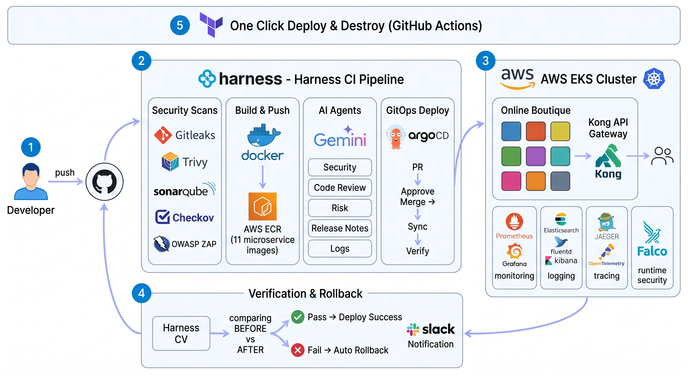
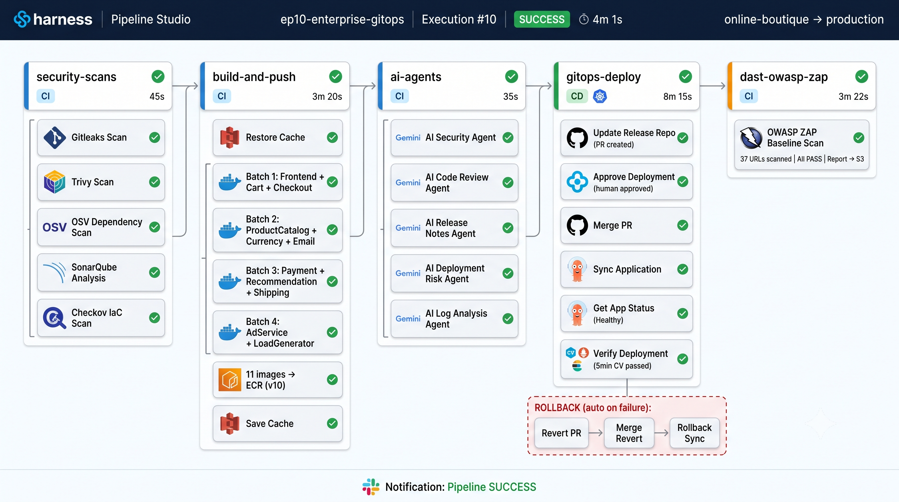

# Episode 10: Complete Enterprise Project (End-to-End)

### 11-Microservices AWS Project

## Architecture



---

## 🎯 Goal

Build the COMPLETE enterprise CI/CD platform — everything from Episodes 1-9 automated with **one `terraform apply`**. Zero manual clicks. MNC production standard.

---

## 🏗️ What This Creates

| Category | Resources |
|----------|-----------|
| **Infrastructure** | VPC → EKS (Auto Mode) → Bastion (SSM + SonarQube) → RDS PostgreSQL |
| **Networking** | Kong Gateway 3.9 (API Gateway + Ingress + NLB + ACM TLS) → ExternalDNS |
| **Security** | External Secrets Operator → AWS Secrets Manager (1 min refresh — bank-grade) |
| **CI/CD** | K8s Delegate (HA) → GitOps Agent (HA) → Harness Platform Resources |
| **Observability** | Prometheus + Grafana → EFK Stack → Jaeger All-in-One + OTel Collector |
| **Governance** | OPA Policies → Continuous Verification (Prometheus) → Auto-Rollback |
| **AI** | 5 Agents — Security, Code Review, Release Notes, Deployment Risk, Log Analysis |
| **DAST** | OWASP ZAP — Post-deploy scan with S3 HTML report |

---

## Pipeline Flow




```
Code Push → Security Scans → Build 11 Images → AI Agents → GitOps Deploy → Verify → DAST → Slack

Stage 1: security-scans (5 parallel)
  Gitleaks | Trivy | OSV Scanner | SonarQube | Checkov

Stage 2: build-and-push (4 batches × 3 parallel)
  S3 Cache Restore → 11 BuildAndPushECR → S3 Cache Save

Stage 3: ai-agents (5 agents)
  Security | Code Review | Release Notes | Risk Assessment | Log Analysis

Stage 4: gitops-deploy
  UpdateReleaseRepo → Approve → MergePR → GitOpsSync → GetAppStatus → Verify (CV)
  Rollback: RevertPR → MergePR → GitOpsSync (auto on failure)

Stage 5: dast-owasp-zap
  ZAP Baseline Scan → S3 presigned URL (7-day browser access)

Notifications: Slack (success/failure)
```

---

## 📁 Project Structure

```
Episode-10/
├── terraform/                          ← Infrastructure as Code (15 modules)
│   ├── main.tf                         ← Root module (orchestrates all + pre-destroy cleanup)
│   ├── variables.tf                    ← All inputs from GitHub Secrets/Variables
│   ├── outputs.tf                      ← Platform outputs
│   ├── provider.tf                     ← AWS, Helm, K8s, Kubectl, Harness providers
│   └── modules/
│       ├── vpc/                        ← VPC + 4 subnets + NAT + IGW + Route Tables
│       ├── eks/                        ← EKS + 2 Node Groups + OIDC + KMS + LB Controller + Autoscaler
│       ├── bastion/                    ← EC2 + SSM + SonarQube + EKS Admin access
│       ├── ecr/                        ← 11 repos + scan-on-push + lifecycle cleanup
│       ├── rds/                        ← PostgreSQL 16.3 + encrypted + auto-creds in AWS SM
│       ├── delegate/                   ← Harness Delegate (HA 2→6, autoscale, RBAC)
│       ├── kong-gateway/               ← Kong 3.9 + NLB + ACM TLS + 20 plugins + Manager UI
│       ├── external-dns/               ← Auto Route53 from Ingress (IRSA, 30s poll)
│       ├── external-secrets/           ← ESO + ClusterSecretStore + app-secrets placeholder
│       ├── gitops/                     ← ArgoCD HA Agent + Repo + Cluster + App
│       ├── harness-platform/           ← Service + Envs + Connectors + OPA + CV
│       ├── monitoring/                 ← Prometheus + Grafana + 2 dashboards (ArgoCD)
│       ├── logging/                    ← Elasticsearch + Kibana + Fluentd (ArgoCD)
│       ├── tracing/                    ← Jaeger All-in-One + OTel Collector (ArgoCD)
│       └── falco/                      ← Runtime Security (DaemonSet + Sidekick UI)
│
├── k8s/                                ← Helm Chart (ArgoCD syncs to cluster)
│   ├── values.yaml                     ← Image tags (pipeline PR updates these)
│   └── templates/                      ← 11 microservices + Redis + Ingress + ExternalSecrets
│
├── .harness/
│   └── enterprise-gitops-pipeline.yaml ← 5 stages: Security → Build → AI → GitOps+CV → DAST
│
├── ai-agents/                          ← 5 AI agents (Gemini 3.5 Flash)
│   ├── security_agent.py             ← Threat assessment
│   ├── code_review_agent.py          ← Code review (score 1-10)
│   ├── release_notes_agent.py        ← Auto changelog
│   ├── deployment_risk_agent.py      ← SAFE/RISKY/BLOCK
│   └── log_analysis_agent.py         ← Pattern detection
│
├── policies/production-governance.rego ← OPA policy
├── architecture/                       ← Diagrams (architecture + pipeline)
├── src/                               ← 11 microservices (Online Boutique)
├── DEPLOY-STEPS.md                    ← 12-step deployment guide
└── README.md                          ← This file
```

---

## 🛡️ Security Stack (9 Layers)

| Layer | Tool | Stage | What It Detects |
|-------|------|-------|-----------------|
| 1 | Gitleaks | CI | Hardcoded secrets, API keys, passwords |
| 2 | Trivy | CI | Filesystem vulnerabilities (HIGH/CRITICAL) |
| 3 | OSV Scanner | CI | Dependency CVEs (Google OSV database) |
| 4 | SonarQube | CI | Code quality, security hotspots |
| 5 | Checkov | CI | Terraform + K8s misconfigurations |
| 6 | OPA Policies | Pipeline Run | Governance (no Friday deploys, require approval) |
| 7 | Approval Gates | GitOps CD | Human review before production |
| 8 | Kong Gateway | Runtime | Rate limiting (10000/min/IP), bot detection, CORS |
| 9 | OWASP ZAP | Post-deploy | XSS, SQL injection, CSRF on live app |

---

## 🔍 Continuous Verification (Auto-Rollback)

| Health Source | Type | Metrics | Rollback When |
|---|---|---|---|
| Prometheus | Metrics | Pod Restarts, CPU Usage, Memory Usage | Pods crash-looping or resource spike after deploy |

**How it works:**
- After GitOps deploys the new version, the **Verify step** runs for 5 minutes (`type: Auto`)
- Harness ML compares pre-deploy baseline vs post-deploy metrics
- If anomaly detected → **automatic rollback** (RevertPR → MergePR → GitOpsSync)
- Build 1: establishes baseline (no comparison, always passes)
- Build 2+: real before vs after comparison

---

## 🌐 Access URLs

| Service | URL | Login |
|---------|-----|-------|
| Online Boutique | `https://app.yourdomain.com` | No login |
| Kong Manager | `https://kong.yourdomain.com` | admin / (AWS SM: `online-boutique/kong-admin-password`) |
| Grafana | `https://grafana.yourdomain.com` | admin / (AWS SM: `online-boutique/grafana-password`) |
| Kibana | `https://kibana.yourdomain.com` | elastic / (AWS SM: `online-boutique/efk-password`) |
| Jaeger | `https://jaeger.yourdomain.com` | No login |
| Falco | `https://falco.yourdomain.com` | admin / (AWS SM: `online-boutique/falco-password`) |
| SonarQube | `http://BASTION-IP:9000` | admin / admin |

All via **1 NLB + Kong Gateway** (cost optimized). ExternalDNS auto-manages Route53.

---

## � Secrets Management (Bank-Grade)

```
AWS Secrets Manager → External Secrets Operator (1 min refresh) → K8s Secret → Pods

No secrets in Git. No hardcoded values. Auto-rotation within 60 seconds.
```

| Secret | Source | Used By |
|--------|--------|---------|
| `COLLECTOR_SERVICE_ADDR` | AWS SM (`app-secrets`) | All services (Jaeger tracing) |
| `REDIS_ADDR` | AWS SM (`app-secrets`) | cartservice |
| DB credentials | AWS SM (`db-credentials`) | All services |
| Grafana password | AWS SM (auto-generated) | Grafana login |
| EFK password | AWS SM (auto-generated) | Elasticsearch + Kibana |
| Kong admin password | AWS SM (auto-generated) | Kong Manager |

---

## 💰 Cost

| Period | Cost |
|--------|------|
| Running | ~$6/day (~$183/month) |
| **After destroy** | **$0.00** |

---

## 📋 How to Use

See **[DEPLOY-STEPS.md](./DEPLOY-STEPS.md)** for complete step-by-step instructions.

**Quick start:**
1. Set GitHub Variables + Secrets (Step 1-3 in DEPLOY-STEPS)
2. Run `ep10-setup.yml → apply` (creates everything ~20 min)
3. Add secrets in AWS SM (Step 6)
4. Import pipeline from Git in Harness
5. Run pipeline → 11 microservices deployed via GitOps
6. When done: `ep10-setup.yml → destroy` (bill = $0)

---

## 🎓 Technologies (25+)

| Category | Technologies |
|----------|-------------|
| **CI/CD Platform** | Harness CI, CD, GitOps, CV, OPA |
| **Containers** | Docker, Multi-stage Builds, ECR (Remote Cache) |
| **Orchestration** | Kubernetes (EKS Auto Mode), Helm, Karpenter |
| **API Gateway** | Kong Gateway 3.9 OSS (HA, 20 plugins, proxy cache) |
| **Infrastructure** | Terraform (14 modules), GitHub Actions (OIDC) |
| **GitOps** | ArgoCD (via Harness GitOps Agent, auto-sync + self-heal) |
| **Database** | RDS PostgreSQL 16.3 (encrypted, auto-creds) |
| **Security** | Trivy, SonarQube, Gitleaks, OSV, Checkov, OWASP ZAP, Falco |
| **Secrets** | AWS Secrets Manager + External Secrets Operator (1 min refresh) |
| **Monitoring** | Prometheus + Grafana (pod health dashboards) |
| **Logging** | Elasticsearch + Fluentd + Kibana (EFK) |
| **Tracing** | Jaeger All-in-One + OpenTelemetry Collector |
| **DNS/TLS** | Route53 + ExternalDNS + ACM Certificate |
| **AI** | Google Gemini 3.5 Flash (5 agents) |
| **Notifications** | Slack |
| **IAM** | Pod Identity (IRSA replacement) |

---

> 🎬 Previous Episode: [Episode 9 - GitOps & Observability](../Episode-09/README.md)
